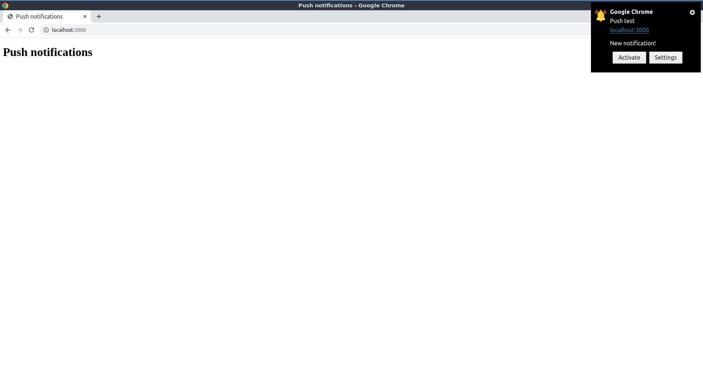

# Push notifications and service workers

## About

An Express server that allows for push notifications subscriptions.

## Features

### Generate VAPID keys

These keys are used for identifying the users who want the push notifications. They can be generated with `web-push` (see [https://www.npmjs.com/package/web-push](https://www.npmjs.com/package/web-push) for more information):

```bash
npx web-push generate-vapid-keys

=======================================

Public Key:
BBUFV0NVh3cC2LpZ_dYmLnuafyGM0tdQTUOUPHuRxbR8_HIbPBp14d_T2r0VxioBpthUn2eIM462q-Vzrb5WFnA

Private Key:
K-urEy4o3QfQFucX9oLbxlE-Ab3UxM1KGrzxmyayuBg

=======================================

```

The server expects this keys to be in the environment variables `PUBLIC_VAPID_KEY` and `PRIVATE_VAPID_KEY`.

### Browser notifications

While the server is running, browsing to [http://localhost:3000](http://localhost:3000) gives a simple web page which requests for allowing notifications. Notice that browsing in incognito mode or with JavaScript disabled prevents this request. After the notifications are allowed, one is displayed like in the image below (notice the custom icon)



## Running

Clone the repo and run either `npm start` (or `npm run dev` for using `nodemon`).

## Acknowledgment

Thanks to [Brad Traversy](https://github.com/bradtraversy) for his [tutorial](https://www.youtube.com/watch?v=HlYFW2zaYQM&list=PLillGF-RfqbZ2ybcoD2OaabW2P7Ws8CWu&index=16).
